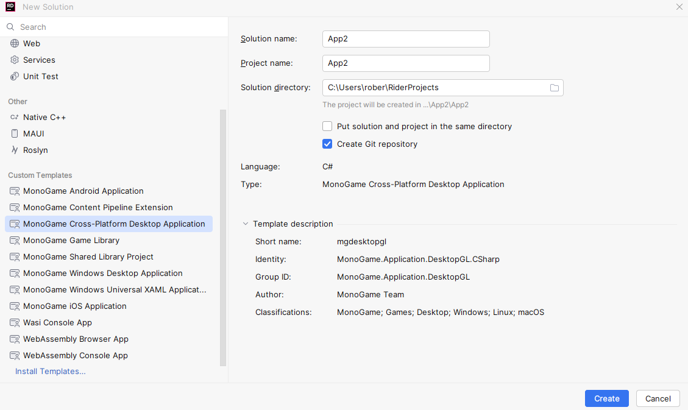
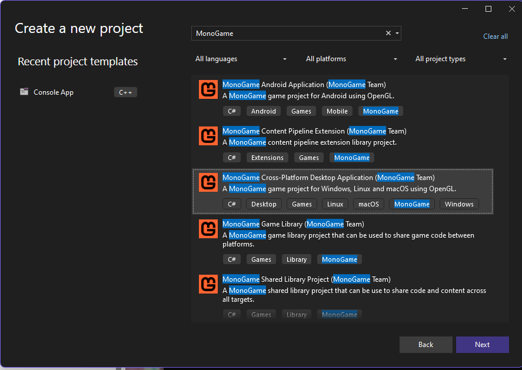

Getting started is pretty straight forward - regardless of the platform or tool chain that you've decided
on. The most difficult decision will be deciding on a project structure.

Supporting a single platform is simple, you would create a single platform specific project.

## Simple Start

The below will create an empty desktop project supporting OpenGL.



```shell
dotnet new mgdekstopgl -o AwesomeGame
cd AwesomeGame
code .
```









## Available Templates

| Cli Name    | Template                           |
|-------------|------------------------------------|
| mgdesktopgl | Cross Platform Desktop Application |
| mgdesktopdx | Windows Desktop Application        |
| mgshared    | MonoGame Shared Library            |
| mglib       | MonoGame Game Library              |
| mgandroid   | MonoGame Android Application       |
| mgpipeline  | Content Pipeline Extension         |
