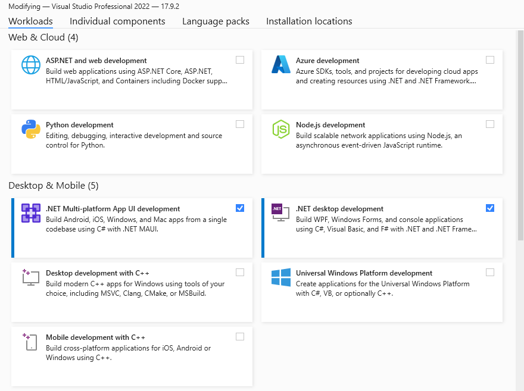


The command line will be heavily used going forward. Generally this gives more consistant results and is not tied to
any particular vendor.



## .NET



```shell
winget install Microsoft.DotNet.SDK.8
```


```bash
sudo apt-get update
sudo apt-get install -y dotnet-sdk-8.0
```


```bash
tba
```


- [.NET SDKs Download](https://dotnet.microsoft.com/en-us/download/visual-studio-sdksw)



## MonoGame Project Templates

```bash
dotnet new install MonoGame.Templates.CSharp
```

## Optional - Workloads
Note that for these workloads to function correctly they need their associated requirements installed before building

```bash
dotnet workload install android
dotnet workload install ios
```

For Android, the easiest way to get the sdk is to install [Android Studio](https://developer.android.com/studio).

For Ios, builds need to be run on physical Mac hardware

## Editors

### Visual Studio 2022 (Windows Only)

Visual Studio 2022 is the minimum required version to build and develop MonoGame with (.NET 6 requirement actually). The
'Community' edition is fine for this unless you are earning over their community license threshold.

- [Visual Studio Downloads](https://visualstudio.microsoft.com/downloads/)

Ensure you select the below workloads during installation.

If you did not install .NET 8 sdk previously make sure it's selected in the 'Individual components' tab.



### Visual Studio Code

Visual Studio Code is more than a plain text editor but not quite a full IDE. It does however run on all platforms -
WIndows, Linux and MacOs.






- [Download Visual Studio Code](https://code.visualstudio.com/download)




```bash
code --install-extension ms-dotnettools.csharp
code --install-extension ms-dotnettools.csdevkit
code --install-extension ms-dotnettools.dotnet-maui
```




### Jetbrains Rider

Jetbrains Rider is commercial alternative to Visual Studio with great performance and - like Visual Studio Code - runs
on all platforms.

- [Jetbrains Rider](https://www.jetbrains.com/rider/)
