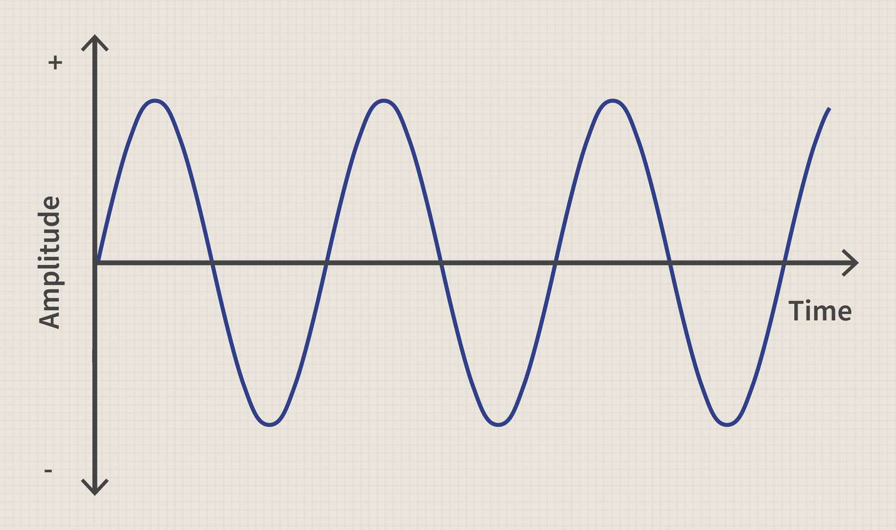

_Assuming a new cross-platform desktop project_

_[Make It Bob - Source](https://github.com/devbitesau/quickshots/blob/main/makeitbob/MakeItBobGame.cs)_

## Assets
This excercise will be using the _moon.png_ asset from [Kenny Background Elements](https://www.kenney.nl/assets/background-elements) - full credit to Kenny for the creation.

Load this into the content tool, remembering to build afterward.


## Intro
Just a nice simple bob action, handy for props or floaty things.

## Bobby

Starting on the code, create some member properties on the Game1 class to store the texture and 
three positions.

```csharp
    // Add variables to store our texture and positions 
    // (We'll be drawing them three times)
    private Texture2D _texture;
    private Vector2 _position1;
    private Vector2 _position2;
    private Vector2 _position3;
```

In the `LoadContent(){}` function, load _moon.png_ into `_texture`.

```csharp
    // Here we load the texture (moon.png) from the Content folder
    _texture = Content.Load<Texture2D>("moon");
```

Directly after this, we'll set the initial positions of our moon friend. There are a number of different ways
to accomplish this, here we simply divide the screen width by 25%, 50% and 75% to spread three moons evenly 
across the canvas. The height is 50% or the middle vertically.

```csharp
    // Nudge to the left (25% of the screen width)
    _position1 = new Vector2(_graphics.PreferredBackBufferWidth * .25f, _graphics.PreferredBackBufferHeight / 2.0f);

    // Center (50% of the screen width)
    _position2 = new Vector2(_graphics.PreferredBackBufferWidth * .50f, _graphics.PreferredBackBufferHeight / 2.0f);

    // Nudge to the right (75% of the screen width)
    _position3 = new Vector2(_graphics.PreferredBackBufferWidth * .75f, _graphics.PreferredBackBufferHeight / 2.0f);
```

Going into the `Update()` method, we'll modify each of these positions in a slightly different manner.

For this one, we'll use a sine curve against the total game time - _not frame time_ - to give us an offset. Applynig
this offset to the `Y` part of the position will make it bob up and down.

```csharp
    // Using a sine curve against the total game time results in a smooth transition
    float y1 = (float)Math.Sin(gameTime.TotalGameTime.TotalSeconds);
    _position1.Y += y1;
```
A visual representation of the `Sin()` calculation can be visualised like in the below diagram.



Straight after this, lets calculate the other two positions we'll end up using.

```csharp
    // Experiment with different curves to see what they look like
    float y2 = (float)Math.Cos(gameTime.TotalGameTime.TotalSeconds);
    _position2.Y += y2;

    // Adjust the result / modify the game time to change the amplitude / speed
    float y3 = (float)Math.Cos(gameTime.TotalGameTime.TotalSeconds*5.0f)*5.0f;
    _position3.Y += y3;
```

Home stretch, going down to the `Draw()` method we'll finish up with getting the texture drawn to the canvas.

Always remember to `_spriteBatch().Begin()` and `_spriteBatch().End()`, placing any draws between these methods.

```csharp
    _spriteBatch.Begin();
    // ... Draw Calls Here ...
    _spriteBatch.End();
```

In here, repeat the below `_spriteBatch.Draw()` 3 times, changing the position property each time (`_position1`, `_position2`, `_position3`).

We'll also center the texture on the draw call to make it easier to observe.

```csharp
    // Draw the texture at the set positions
    // Note here we are reusing the texture, in something more complex you'll probably encapsulate this in a class
    _spriteBatch.Draw(
        _texture,       
        _position1,     // _position2, _position3
        null,
        Color.White,
        0.0f,
        new Vector2(_texture.Width/2f, _texture.Height/2f), // Center the sprite draw call
        1.0f,
        SpriteEffects.None,
        0.0f);
```

All going well, we should have something like the below. Note that this is a most basic example, useful for perhaps
a moon prop in the background that doesn't move. 

An extension to this would be to save the offsets seperatly, keeping the original positions. 
Doing so, an example use might be having a ghost bob as it moves towards a player.

<video controls width="500">
  <source src="../img/makeitbob.mp4" type="video/mp4" />
</video>